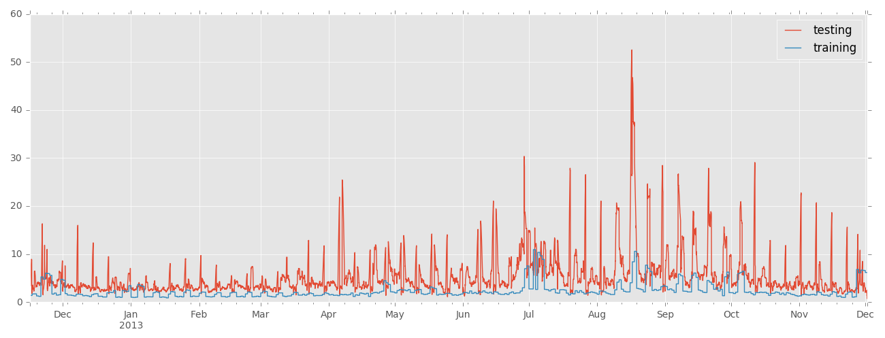
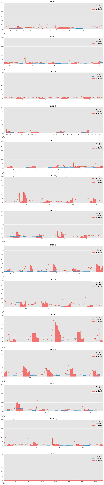

# Objective

Create load forecasting model that takes temperature into account.

Model should be able to train and then predict next 24 hours.

Both in-sample and out-of-sample validation should be done.


# Data
The kWh data is 15 minute interval data and runs from roughly 11/1/12 to 12/1/13.


# EDA

Please see the notebook for EDA


# Modeling

## Model selection

After doing EDA, it doesn't seem that temperature is the most important feature in predicting load. There are significant periods of time where temperature varies quite dramatically but load remains relatively constant.

It seems like the most significant predictor for what the load will be is what the load was. However, depending on the situation, the lag to use here varies. For example, when trying to predict Saturday, the data from Friday is probably not as useful as the data from last Friday due to the reduced usage and different trends on weekdays vs weekends.

Based on this, I think that having multiple models to predict various periods of time within the 24 hours would be the best approach. It would also be helpful to have separate weekday and weekend models. The most extreme - and potentially best - implementation of this would be to have at least 96 models: one for every 15 minute interval for the next 24 hours and weekend and weekday versions of each. However, given the time constraints here I will just build a few.

From EDA, it was also clear that there are significant correlations between temperature and the time variables (time of day and month for instance).

In order to incorporate the idea that both temperature and previous load are important features in predicting future load and also include the interactions between all these, I decided to try ensemble tree algorithms with lag variables rather than time series modelling or regression.

### Weekend model

This model will be trained as a regression on just past weekend data. Based on EDA it looks like weekend usage actually goes from around 4:00 on Saturdays through to around 8:00 on Mondays.

### Weekday model

One of the main disadvantages with using a RandomForestRegressor is that it will not be able to predict any value outside of the range of training data. However, it is useful in terms of being able to determine feature importance on its own as well as accounting for 'interactions' between features.

## Starting point

In order to accurately make any kind of prediction for a full 24 hours in the future, I think at least 7 days of data is necessary. This means that I will not be doing any test error evaluation on the first week of data. Given that there are over 56 weeks of data, I think the remaining data will still give sufficient opportunities for evaluating test error.

## Issues with temperature

Trying to predict using temperature as a feature poses a problem here because in reality we would only have __forecasted__ temperature but we are given __actual__ temperature.

The question becomes: what data should be used for temperature in order to predict the next 24 hours? Testing the model with future actual temperature data is obviously not an accurate representation of what would happen in reality. However, predicting temperature itself in order to use it as a feature in the model to predict load is also not representative.

Ultimately, I decided to use future actual temperature data to test and validate. Given more time, I would instead hit a weather API and get forecasted temperature for the next 24 hours. The critical assumption here is that temperature forecasts are relatively accurate within a 24 hour period, i.e. forecasted temperature for the next 24 hours would not have differed that much from the actual temperature.

## Re-training frequency

I could retrain the models every 15 minutes as new data is added but for the purposes of this exercise I will retrain every 24 hours instead.


# Validation

All results are recorded in `out.log`

## Regression results

An example of regression results:

```
Sat, Nov 17, 2012
                            OLS Regression Results                            
==============================================================================
Dep. Variable:                      y   R-squared:                       0.740
Model:                            OLS   Adj. R-squared:                  0.733
Method:                 Least Squares   F-statistic:                     102.2
Date:                Mon, 27 Feb 2017   Prob (F-statistic):           3.62e-60
Time:                        14:36:15   Log-Likelihood:                -386.47
No. Observations:                 222   AIC:                             786.9
Df Residuals:                     215   BIC:                             810.8
Df Model:                           6                                         
Covariance Type:            nonrobust                                         
==============================================================================
                 coef    std err          t      P>|t|      [95.0% Conf. Int.]
------------------------------------------------------------------------------
const         48.5763      1.421     34.188      0.000        45.776    51.377
x1            -0.3780      0.033    -11.568      0.000        -0.442    -0.314
x2             0.0055      0.001      9.322      0.000         0.004     0.007
x3         -3.171e-05   3.93e-06     -8.075      0.000     -3.95e-05  -2.4e-05
x4          6.529e-08   8.69e-09      7.513      0.000      4.82e-08  8.24e-08
x5             0.0634      0.029      2.209      0.028         0.007     0.120
x6            -0.1068      0.016     -6.489      0.000        -0.139    -0.074
==============================================================================
Omnibus:                        4.221   Durbin-Watson:                   1.291
Prob(Omnibus):                  0.121   Jarque-Bera (JB):                5.141
Skew:                          -0.092   Prob(JB):                       0.0765
Kurtosis:                       3.722   Cond. No.                     1.24e+10
==============================================================================
```

Results varied quite dramatically. For example:

```
Sun, May 12, 2013
                            OLS Regression Results                            
==============================================================================
Dep. Variable:                      y   R-squared:                       0.222
Model:                            OLS   Adj. R-squared:                  0.207
Method:                 Least Squares   F-statistic:                     14.78
Date:                Mon, 27 Feb 2017   Prob (F-statistic):           7.22e-15
Time:                        14:37:41   Log-Likelihood:                -748.05
No. Observations:                 318   AIC:                             1510.
Df Residuals:                     311   BIC:                             1536.
Df Model:                           6                                         
Covariance Type:            nonrobust                                         
==============================================================================
                 coef    std err          t      P>|t|      [95.0% Conf. Int.]
------------------------------------------------------------------------------
const         52.6459      1.596     32.978      0.000        49.505    55.787
x1            -0.1512      0.034     -4.464      0.000        -0.218    -0.085
x2             0.0015      0.000      3.445      0.001         0.001     0.002
x3         -5.348e-06   2.02e-06     -2.644      0.009     -9.33e-06 -1.37e-06
x4           6.24e-09   3.14e-09      1.986      0.048      5.68e-11  1.24e-08
x5            -0.0268      0.026     -1.043      0.298        -0.077     0.024
x6            -0.1012      0.025     -4.089      0.000        -0.150    -0.052
==============================================================================
Omnibus:                      364.399   Durbin-Watson:                   0.482
Prob(Omnibus):                  0.000   Jarque-Bera (JB):            21340.907
Skew:                           5.008   Prob(JB):                         0.00
Kurtosis:                      41.863   Cond. No.                     3.80e+10
==============================================================================
```
Given more time I would like to do

## RandomForest results

I looked at feature importances each time model was retrained. Top 5 values generally remain consistent, although order does change.

```
RandomForest Regression Results

==============================================================================
Feature importances:

['lag-1',
'last_week',
'hour',
'yesterday',
'temp',
'lag-11',
'lag-2',
'lag-3',
'lag-7',
'lag-4',
'lag-6',
'lag-9',
'lag-10',
'lag-5',
'lag-8',
'lag-12',
'dow']
```

## Overall results



We can see that model does not too bad up until April 2013 but testing error increases significantly at this point.

Overall, training error remains low for the entire dataset. 

It appears that the model regularly fails to predict a certain time period accurately.



We can see from here that it is the transition zone from weekdays to weekends and vice versa that the model consistently gets high test error on. Some of the weekends themselves also have higher error, as predicted from wildly varying R-squared results. With a more sophisticated ensemble model I think I could capture the pattern of this transition better and produce a better model for weekend usage.

As suspected, anomalies such as outage and irregular weekends did not get predicted accurately. In the scope of this exercise, this is to be expected.
